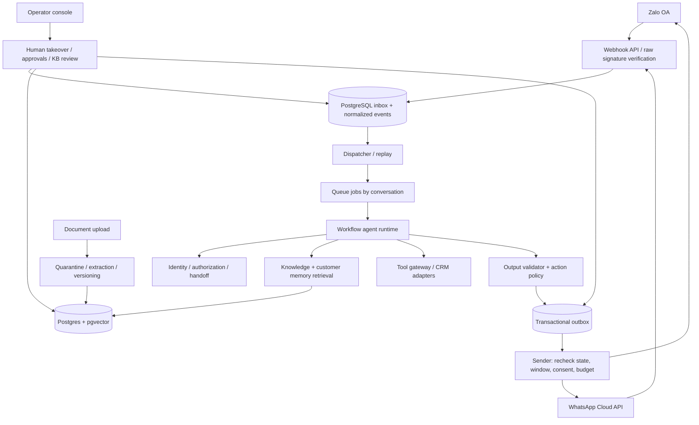

# 02 — Kiến trúc triển khai

## 1. Quyết định mặc định

Chọn **modular monolith + background worker**, không microservices từ đầu. Một ngôn ngữ TypeScript để các coding agent dùng chung schema và giảm sai lệch interface. Next.js cho console; Fastify cho REST/webhook; worker Node.js; PostgreSQL làm nguồn dữ liệu chuẩn, pgvector cho embedding; Redis + BullMQ cho job/lock hỗ trợ; object storage tương thích S3 cho tài liệu. Đây là lựa chọn đề xuất, chưa cài đặt.

SB-02 kiểm tra phiên bản đang được hỗ trợ của Node/package/framework/DB/vector extension, pin Docker image và lockfile. Dùng thư viện hiện hành sau compatibility spike, không dùng WhatsApp SDK đã archived [S10 trong 00]. Model sau adapter `LLMProvider`; chọn model bằng eval tiếng Việt, structured output, độ trễ, xử lý dữ liệu và chi phí. Không gắn runtime với tên model hoặc API version đoán từ trí nhớ.

## 2. Sơ đồ



## 3. Cấu trúc code cần tạo

```text
apps/
  api/                  # webhooks, authenticated REST, health
  worker/               # dispatcher, agent runs, ingest, sender, purge
  console/              # inbox, customers, knowledge, approvals, settings
packages/
  contracts/            # JSON Schema + generated TS + OpenAPI
  db/                   # migrations, tenant-scoped repositories
  auth/                 # operator RBAC, server-side scope derivation
  channels/             # zalo, whatsapp, mock, policy evaluator
  identity/             # customer mapping / link / verification
  knowledge/            # ingest, chunk, hybrid retrieve, source validation
  memory/               # extraction, lifecycle, privacy, consolidation
  agent-runtime/        # finite workflow, prompt/version, budgets
  tools/                # CRM/order/ticket adapters, approval gateway
  observability/        # traces, metrics, redaction
infra/                  # compose, deployment templates, runbooks
contracts/              # design schemas supplied in planning baseline
planning/               # backlog DAG
prompts/                # runtime prompt versions after implementation
 evals/                  # synthetic + access-controlled evaluation sets
```

Root `contracts/` là nguồn thiết kế; SB-03 đưa vào build/codegen có một nguồn sự thật, không duy trì hai bộ schema độc lập. Đường dẫn `evals/` ở root (bỏ khoảng thụt trong minh họa).

## 4. Inbound: nhận nhanh nhưng không mất tin

1. Route chỉ đến đúng channel binding đã đăng ký; đọc raw bytes có giới hạn kích thước.
2. Xác minh chữ ký bằng secret của binding/app; kiểm tra account nhận và schema. Payload không đáng tin không được tự chọn tenant.
3. Transaction lưu raw event đã mã hóa hoặc reference tối thiểu, inbox receipt, các normalized event và cursor cần dispatch. Dedup theo khóa provider phù hợp; event receipt không đồng nghĩa đã xử lý.
4. Chỉ ACK thành công sau commit. DB lỗi trả lỗi thích hợp để provider retry; không gọi LLM trong HTTP webhook.
5. Dispatcher lấy pending rows có lease bằng DB transaction, enqueue job ID ổn định; job cũng idempotent. Sweeper tìm inbox đã ACK nhưng chưa có job nếu queue/Redis lỗi.
6. Worker serialize theo `(tenant_id, channel_binding_id, external_user_id)`/conversation. DB optimistic version là nguồn kiểm soát; Redis lock không là bảo đảm duy nhất.
7. Lưu provider timestamp và thời điểm nhận riêng; không lùi `last_eligible_interaction_at` do event đến trễ. Tin đến cùng lúc có debounce ngắn cấu hình được, không làm mất ý định yêu cầu gặp người.

## 5. Workflow runtime

`RECEIVE → CHECK_SCOPE_AND_HANDOFF → CLASSIFY → RETRIEVE → PLAN → OPTIONAL_TOOL → DRAFT → VALIDATE → ENQUEUE_REPLY → MEMORY_CANDIDATES`.

Mỗi bước có trạng thái persisted, timeout, retry policy và budget. Bước tool không lặp vô hạn: mục tiêu ban đầu tối đa 3 tool calls, 2 lần soạn/chỉnh, 1 model fallback được cho phép xử lý dữ liệu cùng cấp. Vượt ngân sách/timeout chuyển người, không tự tăng limit.

Model chỉ đề xuất quyết định JSON theo schema. Authorization, điều kiện gửi, approval và quyền dữ liệu nằm trong code. Classifier bị sai không được làm mất tenant boundary. Tóm tắt dùng để tiết kiệm context; thông tin quan trọng phải kiểm lại nguồn.

## 6. Outbound: atomic intent, không hứa exactly-once

Transaction ghi agent decision + outbox intent + expected conversation ownership version. Sender claim từng row, kiểm tra kill switch, handoff state, opt-out, cửa sổ gửi, template approval, quota và ngân sách **ngay trước dispatch**. Handoff cũng lấy cùng mutex/DB ownership protocol; phải có test race giữa takeover và send. Tin đã bắt đầu gửi đến provider trước takeover có thể không thu hồi được; console hiển thị trạng thái in-flight thay vì cam kết hủy được.

Khóa dedup intent gồm tenant, conversation, causal event, loại action và phiên bản reply. `pending → dispatching → accepted → delivered/read` hoặc `failed`, `blocked`, `unknown`. Provider acceptance không đồng nghĩa delivered. Status webhook chỉ tiến trạng thái hợp lệ; trạng thái đến sai thứ tự không lùi delivered thành sent.

Timeout khi gửi có thể là provider đã nhận nhưng client chưa biết: đặt `unknown`, đối soát bằng message ID/status nếu có; không retry mù. Nếu provider không có cơ chế tra cứu/idempotency đủ chắc, chuyển review thủ công. Không có bảo đảm exactly-once end-to-end chỉ vì dùng BullMQ/outbox. Worker retry phải idempotent [S14].

## 7. Tách môi trường và trust boundary

Local dùng fixtures synthetic, mock channel, mock CRM, fake LLM; compose DB/Redis/object storage. Staging dùng account sandbox/test và ngân sách thấp; production dùng secret, database, buckets, app binding riêng. Console không cầm OA/Meta token; browser gọi API có operator auth.

RLS là lớp phòng vệ bổ sung: runtime không dùng owner/superuser/BYPASSRLS; `FORCE ROW LEVEL SECURITY` nơi phù hợp, scoped transaction và composite tenant foreign keys [S12]. Chỉ filter trong UI không đủ. Service migration/admin quyền cao phải tách khỏi request/worker runtime.

## 8. Quan sát và thất bại

Trace đi qua receipt → job → run → retrieval → tool → outbox → provider status bằng ID, không raw PII. Circuit breaker riêng từng provider/tenant để một OA hết quota không làm nghẽn cả hệ thống. Dead-letter queue có reason/replay audit; replay vẫn chạy mọi safety gate.

Nếu LLM lỗi: giữ case, thông báo theo policy hoặc tạo handoff. Nếu KB lỗi: không trả từ trí nhớ mô hình. Nếu CRM lỗi: không báo trạng thái đơn cũ là mới. Nếu policy config chưa xác minh: chặn tự gửi và tạo draft. Nếu queue down nhưng DB còn hoạt động: receipt vẫn lưu; dispatcher bù sau, dashboard báo delay.

## 9. ADR ban đầu

ADR-001: relational + vector trước, graph/fine-tune sau nếu có đo lường chứng minh cần. ADR-002: một workflow agent thay runtime multi-agent, dễ test và kiểm soát action. ADR-003: channel adapter tách policy, không copy một cửa sổ chung. ADR-004: durable inbox/outbox, chấp nhận at-least-once nội bộ và xử lý outbound unknown rõ ràng. ADR-005: customer memory riêng tư, knowledge dùng chung có duyệt. ADR-006: deployment bằng container portable, chưa mua/provision hạ tầng trong planning baseline.
